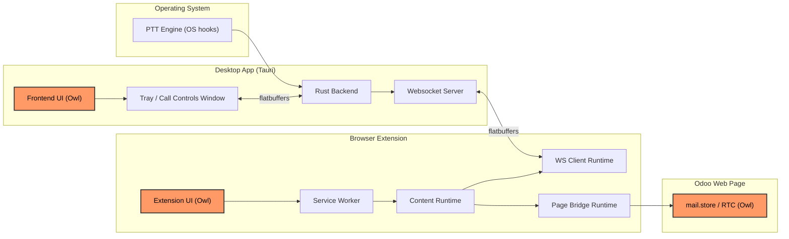

# Discuss Companion Architecture

## System Overview
Discuss Companion connects global push-to-talk input from the desktop environment to Odoo Discuss calls running in the browser.

The desktop app capture input and owns runtime state, while the extension bridges bowser runtime contexts and interacts with Osoo call services.

## High-Level Components
1. Desktop app (`app/`):
   - Rust backend: global key capture, WS server, tray/call-controls integration.
   - Owl frontend: keybinding setup, runtime status, settings, and call controls.
2. Browser extension (`extension/`):
   - Service worker: ownership, routing, extension state.
   - Content runtime: WS client, bridge coordination, call-state forwarding.
   - Page bridge runtime: direct interaction with Odoo RTC APIs in page context.
3. Odoo page:
   - Uses `mail.store` and `rtc.localSession` as live call state and action endpoints.

## Data and Control Flows
1. PTT flow:
   - OS keyboard hook -> Rust backend -> extension WS client -> content runtime -> page bridge -> Odoo RTC push-to-talk methods.
2. Call command flow:
   - App UI command -> backend WS `status` payload -> extension content runtime -> bridge call action -> Odoo RTC action.
3. Call state flow:
   - Odoo session changes -> extension bridge/content/service worker -> WS call-state message -> backend -> app frontend event channel.

## Extension Runtime Overview
Te extension is split across browser contexts with explicit boundaries:
1. Service worker controls ownership, icon state, and popup-to-tab routing.
2. Content runtime manages bridge lifecycle, app WS connectivity, and state synchronization.
3. Page bridge runs in page context and performs RTC actions on `rtc.localSession`.

Detailed module-level behavior is documented in the extension architecture reference.

## Protocols
1. WebSocket protocol (`ws_protocol.fbs`):
   - Used betwen the app backend and extension WS runtime.
   - Carries PTT signals, command/status payloads, and call state.
2. IPC protocol (`ipc_protocol.fbs`):
   - Used between Rust backend and Owl frontend.
   - Carries frontend events, state updates, and control commands.
3. Both protocols use FlatBuffers for binary framing and shared schema contracts.

## Where to Read More
- [Extension Architecture](./extension/src/ARCHITECTURE.md)
- [App Features Guide](./app/README.md)
