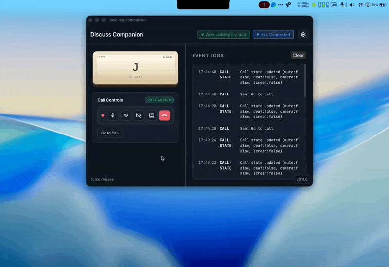

# Discuss Companion
[](https://github.com/ThanhDodeurOdoo/discuss-companion/actions/workflows/ui.yml)
[](https://github.com/ThanhDodeurOdoo/discuss-companion/actions/workflows/extension.yml)
[](https://github.com/ThanhDodeurOdoo/discuss-companion/actions/workflows/api_tests.yml)

[](https://github.com/ThanhDodeurOdoo/discuss-companion/actions/workflows/github-code-scanning/codeql)

### targets

[](https://github.com/ThanhDodeurOdoo/discuss-companion/actions/workflows/macOS.yml)
[](https://github.com/ThanhDodeurOdoo/discuss-companion/actions/workflows/ubuntu.yml)
[](https://github.com/ThanhDodeurOdoo/discuss-companion/actions/workflows/debian.yml)
[](https://github.com/ThanhDodeurOdoo/discuss-companion/actions/workflows/debian-x11.yml)

The Discuss Companion is a companion app for Odoo Discuss, currently supporting macOS and Linux (X11). It provides system-wide Push-to-Talk (PTT) capabilities, allowing you to use your PTT key even when the browser is not in focus, along with convenient quick-access call control features when in a call in Odoo Discuss. This also requires the extension to be installed in a compatible browser (chromium / firefox).



The app backend is written in Rust, the app frontend (and the extension) is written in TypeScript using [Owl v3](https://github.com/odoo/owl) as the framework.

## Architecture

The repository contains 2 parts:
1.  **The App (macOS and Linux)**:
    -   Captures global key events using platform-specific APIs and runs a WebSocket server.
    -   macOS: Uses Core Graphics Event Tap
    -   Linux: Uses XRecord (X11 only, Wayland not yet supported)
2.  **The Extension (Chrome & Firefox)**:
    -   Connects to the desktop agent via WebSockets and relays PTT signals to the Odoo web page.

The communication between the App and the Extension (WS), and between the backend and the frontend of the app (IPC) uses [FlatBuffers](https://google.github.io/flatbuffers/), The schema is defined in `ws_protocol.fbs` and `ipc_protocol.fbs`. 


## Development

Read [CONTRIBUTING.md](https://github.com/ThanhDodeurOdoo/discuss-companion/blob/master/CONTRIBUTING.md).

### Prerequisites

#### Dev:
- For the App deployment and building the extension:
    -  **Rust (v1.92+)** ([link](https://rustup.rs/))
    -  **Node.js (v24.13.0+)** ([link](https://nodejs.org/en/download))
-  If you need to change the protocol schema:
    -  **flatbuffers (latests)** ([link](https://flatbuffers.dev/flatc/))
#### Main:
-  **Browser**: Google Chrome or Mozilla Firefox required for the extension.
-  **OS**: macOS or Linux (X11 only, Wayland not yet supported).


### Running Locally
1.  **Install dependencies**:
    ```bash
    npm install
    ```
2.  **Start the app in development mode (also builds the extension)**:
    ```bash
    npm run dev        # Builds extension + runs the app for your current OS
    npm run dev:x11    # Linux (X11) feature flag
    ```

3.  **Permissions**:
    -   On the first run, macOS will prompt for **Accessibility Permissions** (it will appear as permissions to your IDE or whatever spawns the app).
    -   Grant permission in `System Settings` → `Privacy & Security` → `Accessibility`.
    -   Restart the app after granting permission.


## Extension

see [Extension's Readme](./extension/README.md)

> [!WARNING]  
> The extension is not compatible with the Odoo Discuss extension
>

To link the app with Odoo:

1.  **Build the unpacked Extensions**:
    ```bash
    # Build for both Chrome and Firefox
    npm run dev:extension
    ```
    This will generate `extension/dist/chrome` and `extension/dist/firefox`.
    Running `npm run dev` also builds these directories.

2.  **Load in Browser**:
    -   **Chrome**:
        1.  Navigate to `chrome://extensions/`.
        2.  Enable **Developer mode**.
        3.  Click **Load unpacked** and select `extension/dist/chrome`.
    -   **Firefox**:
        1.  Navigate to `about:debugging#/runtime/this-firefox`.
        2.  Click **This Firefox**.
        3.  Click **Load Temporary Add-on...** and select `extension/dist/firefox/manifest.json`.

    Refresh your Odoo tab after loading.

---

## Deployment & Distribution

### Build for Production
```bash
npm run build         # Packed extensions + app bundle
npm run build:app     # App bundle only
npm run build:extension # Packed extensions only
```
The app output will be generated in `app/backend/target/release/bundle/`.
The packed extensions are generated at `extension/dist/chrome.zip` and `extension/dist/firefox.zip`.

### Choosing the Target OS
The application automatically detects the target OS based on the build environment. If you want to build for a specific target manually using Cargo:

- **macOS**: `npm run tauri build -- --target aarch64-apple-darwin`
- **Linux (X11)**: `npm run tauri build -- --target x86_64-unknown-linux-gnu -- --features x11`

> [!NOTE]
> Linux support requires X11. Wayland is not yet supported.
> see: [Issue#1](https://github.com/ThanhDodeurOdoo/discuss-companion/issues/1)

When using Tauri, the target is determined by the host system:
```bash
npm run build:app # Builds for the current OS
```

### Continuous Integration
The project includes three main GitHub Actions suites that run on every push and pull request to `main` and `master`:
- **UI**: Handles frontend linting (ESLint) and app-specific testing. Tests only run if linting passes.
- **Extension**: Handles testing for the Chrome extension components.
- **Systems**: Handles backend (Rust) linting (fmt, clippy) and testing. Tests only run if linting passes.
- **API Tests**: Handles integration testing for both IPC and WebSocket APIs.

---

## Usage
1.  Launch the **Discuss Companion**.
2.  Ensure the status indicator says **"Accessibility Granted"**.
3.  In Odoo Discuss, enter a voice call.
4.  The agent will automatically detect your PTT key (Default: **Space**) and activate your microphone in Odoo.
5.  Use the **System Tray** icon (top right of your macOS bar) to Show/Hide the monitoring window or Quit the app.

---

## Configuration
The WebSocket port (default: 49152) can be configured if needed (e.g. to avoid conflicts):
-   **App**: Change it directly in the main interface and click "Reload".
-   **Extension**: Right-click the extension icon -> Options to set the matching port.

---

## Security & Privacy
-   The "Event Tap" only listens for the specific key codes configured for PTT.
-   The WebSocket server runs on `localhost` (configurable) and does not accept external connections.

---

## Safety Features
The application includes several mechanisms to ensure the microphone does not get stuck in the "active" state:
1.  **Robust Key Tracking**: The system tracks the specific key states to prevent stuck keys on partial release.
2.  **Safety Release Button**: A small "force release" button in the main window immediately forces a "PTT Up" signal, resetting the internal state.
3.  **Auto-Release on Quit**: When the application quits (Command-Q or Menu Exit), it automatically sends a "PTT Up" signal to ensure your Odoo microphone is muted before the process terminates.

---

## Contributing
Interested in contributing? Please see our [CONTRIBUTING.md](./CONTRIBUTING.md) for guidelines on code style, testing, and more.
