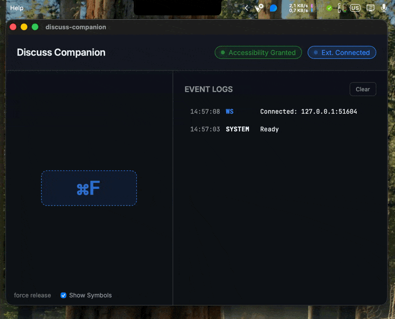

# Discuss Companion

[](https://github.com/ThanhDodeurOdoo/discuss-companion/actions/workflows/systems.yml)
[](https://github.com/ThanhDodeurOdoo/discuss-companion/actions/workflows/ui.yml)
[](https://github.com/ThanhDodeurOdoo/discuss-companion/actions/workflows/extension.yml)

The Discuss Companion is a companion app for Odoo Discuss, currently supporting macOS (Linux support is Work in Progress). It provides system-wide Push-to-Talk (PTT) capabilities, allowing you to use your PTT key even when the browser is not in focus.


## Architecture

The repository contains 2 parts:
1.  **The App (macOS and Linux\*)**:
    -   Captures global key events using platform-specific APIs and runs a WebSocket server.
    -   front-end built with [Owl v3](https://github.com/odoo/owl).
    -   back-end built with [Rust](https://www.rust-lang.org/).
2.  **The Extension (Chrome & Firefox)**:
    -   Connects to the desktop agent via WebSockets and relays PTT signals to the Odoo web page.
  
*: not yet

The communication between the App and the Extension uses [FlatBuffers](https://google.github.io/flatbuffers/), The schema is defined in `protocol.fbs`. These messages are sent through websocket.


## Development

### Prerequisites

#### Dev:
-  **Rust Toolchain**: [Install Rust](https://rustup.rs/)
-  **flatbuffers**: Required for the `flatbuffers` code generation (if you need to change the protocol).
-  **Node.js**: Version 18+ and `npm`
#### Main:
-  **Browser**: Google Chrome or Mozilla Firefox required for the extension.
-  **OS**: macOS (Linux support coming soon).


### Running Locally
1.  **Install dependencies**:
    ```bash
    npm install
    ```
2.  **Start the app in development mode**:
    ```bash
    npm run dev
    ```

3.  **Permissions**:
    -   On the first run, macOS will prompt for **Accessibility Permissions** (it will appear as permissions to your IDE or whatever spawns the app).
    -   Grant permission in `System Settings` → `Privacy & Security` → `Accessibility`.
    -   Restart the app after granting permission.


## Extension Setup

To link the app with Odoo:

1.  **Build the Extension**:
    ```bash
    # Build for both Chrome and Firefox
    npm run build:extension
    ```
    This will generate `extension/dist/chrome` and `extension/dist/firefox`.

2.  **Load in Browser**:
    -   **Chrome**:
        1.  Navigate to `chrome://extensions/`.
        2.  Enable **Developer mode**.
        3.  Click **Load unpacked** and select `extension/dist/chrome`.
    -   **Firefox**:
        1.  Navigate to `about:debugging`.
        2.  Click **This Firefox**.
        3.  Click **Load Temporary Add-on...** and select `extension/dist/firefox/manifest.json`.

    Refresh your Odoo tab after loading.

---

## Deployment & Distribution

### Build for Production
The output will be generated in `app/backend/target/release/bundle/`.

### Choosing the Target OS
The application automatically detects the target OS based on the build environment. If you want to build for a specific target manually using Cargo:

- **macOS**: `cargo build --target x86_64-apple-darwin` or `aarch64-apple-darwin`
- **Linux**: `cargo build --target x86_64-unknown-linux-gnu` (Note: PTT engine not yet implemented)

> [!WARNING]  
> LINUX TARGET IS NOT YET IMPLEMENTED, pull requests are welcome I do not have a Linux machine to test on.
> see: [Issue#1](https://github.com/ThanhDodeurOdoo/discuss-companion/issues/1)

When using Tauri, the target is determined by the host system:
```bash
npm run build:app # Builds for the current OS
```

### Continuous Integration
The project includes three main GitHub Actions suites that run on every push and pull request to `main` and `master`:
- **UI**: Handles frontend linting (ESLint) and app-specific testing. Tests only run if linting passes.
- **Extension**: Handles testing for the Chrome extension components.
- **Systems**: Handles backend (Rust) linting (fmt, clippy) and testing. Tests only run if linting passes.

---

## Usage
1.  Launch the **Discuss Companion**.
2.  Ensure the status indicator says **"Accessibility Granted"**.
3.  In Odoo Discuss, enter a voice call.
4.  The agent will automatically detect your PTT key (Default: **Space**) and activate your microphone in Odoo.
5.  Use the **System Tray** icon (top right of your macOS bar) to Show/Hide the monitoring window or Quit the app.

---

## Configuration
The WebSocket port (default: 49152) can be configured if needed (e.g. to avoid conflicts):
-   **App**: Change it directly in the main interface and click "Reload".
-   **Extension**: Right-click the extension icon -> Options to set the matching port.

---

## Security & Privacy
-   The "Event Tap" only listens for the specific key codes configured for PTT.
-   The WebSocket server runs on `localhost:49152` (configurable) and does not accept external connections.

---

## Safety Features
The application includes several mechanisms to ensure the microphone does not get stuck in the "active" state:
1.  **Robust Key Tracking**: The system tracks the specific key states to prevent stuck keys on partial release.
2.  **Safety Release Button**: A small "force release" button in the main window immediately forces a "PTT Up" signal, resetting the internal state.
3.  **Auto-Release on Quit**: When the application quits (Command-Q or Menu Exit), it automatically sends a "PTT Up" signal to ensure your Odoo microphone is muted before the process terminates.

---

## Contributing
Interested in contributing? Please see our [CONTRIBUTING.md](./CONTRIBUTING.md) for guidelines on code style, testing, and more.
