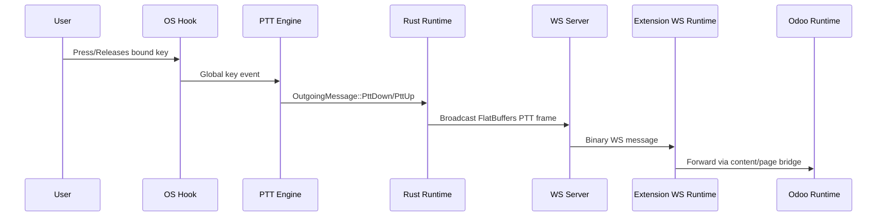
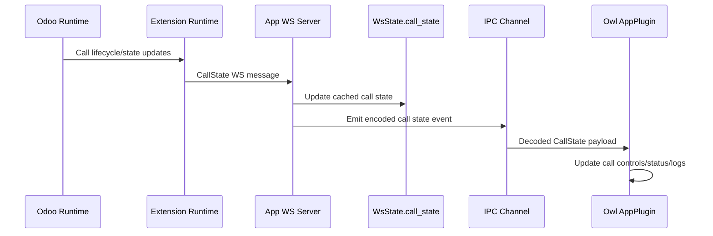

# Discuss Companion App Architecture

## Scope and Boundaries
Ths document covers the desktop app runtime in `app/`:
1. Rust backend process and platform integrations.
2. Owl frontend state orchestration.
3. IPC between frontend/backend.
4. WS coordination with the browser extension.

Out of scope:
1. Extension internals beyond app-facing integration points.
2. Odoo page runtime internals.

## Runtime Components
1. Backend runtime (`app/backend/src/runtime.rs`):
   - Composes Tauri plugins, commands, tray/window behavior, WS server lifecycle, and PTT event loop.
2. Backend API layer (`app/backend/src/api/commands.rs`):
   - Tauri commands for binding updates, recording mode, WS port, app visibility, force release, and call commands.
3. Websoket server (`app/backend/src/api/ws_server.rs`):
   - Localhost server for extension connectivity, ping/pong, incoming control frames, and call-state updates.
4. Frontend plugin (`app/frontend/app_plugin.ts`):
   - Signal-based state model and event handlers for permissions, logs, call state, settings, and commands.
5. IPC codec/transport (`app/frontend/ipc.ts`):
   - FlatBuffers encoding for requests and decoding for backend event messages.

## Backend (Rust) Internals
1. App wiring:
   - `build_app` registers plugins, loads persisted settings, starts WS + PTT workers, and sets tray/dock/window hooks.
2. Shared state:
   - `WsState` stores WS port, broadcaster channels, connection state channel, event channels, and cached call state.
   - `AppSettings` stores visibility mode.
3. Command surface:
   - Version/features, permission checks, binding update, recording mode, current binding, WS port update/restart, channel establishment, and call command dispatch.
4. Event propagation:
   - Backend emits frontend events (`ptt-event`, `ws-server-status`) and forwards WS connection status/call state through IPC event channels.

## Frontend (Owl) Internals
1. `AppPlugin` is the central controller:
   - Owns reactive state via Owl signals.
   - Initializes theme, features, current binding, WS port, and permission state.
   - Subscribes to backend channel events and maps them to UI state/log entries.
2. UI composition:
   - `companion.xml` switches between control/log views and settings view.
   - `control_page.xml` renders binding controls and call actions.
   - `settings_page.xml` manages appearance, visibility mode, and WS port reload.
   - `header.xml` and `footer.xml` show runtime status and safety/version actions.

## IPC Channel Design
1. Transport:
   - Tauri `Channel` created by frontend and registered via `establish_channel`.
2. Encoding:
   - Frontend command requests use FlatBuffers payloads (`SetRecordingMode`, `SetWsPort`, `PttBinding`).
3. Event decoding:
   - Frontend decodes `ToFrontendMessage` unions into typed UI events (PTT, WS status, call state, backend error, incoming WS messages).
4. Startup behavior:
   - `establish_channel` sends cached call state immediately when present, then stores channel for future broadcasts.

## WebSocket Coordination with Extension
1. Server lifecycle:
   - Backend listens on `127.0.0.1:<port>` and can restart on runtime port changes.
2. Outbound app->extension:
   - PTT down/up frames.
   - Call command payloads serialized as `Status` frames.
3. Inbound extension->app:
   - Ping (responded by pong), optional binding/control messages, and call-state snapshots.
4. Connection state:
   - Global connection count tracks onlline/offline status and is propagated to frontend and tray state.

## Platform-Specific PTT Engines
1. macOS:
   - CoreGraphics-based global key event capture.
2. Linux (X11):
   - X11/XRecord path for global input capture.
3. Windows TODO.

## Tray, Dock, and Window Lifecycle
1. Tray icon state:
   - Updated from combined WS connectivity + active speaking state.
2. Call controls menu/window:
   - Driven from backend call state updates.
3. Main window close behavior:
   - Close requests hide window instead of exiting.
4. macOS activation policy:
   - Runtime visibility mode controls tray/dock presentation.

## State Persistence
Persisted throug Tauri store:
1. PTT binding (`PTT_BINDING`).
2. WebSocket port (`WS_PORT`).
3. App visibility mode (`APP_VISIBILITY_MODE`).

Runtime-only state includes call state cache, active connection count, and transient UI signals/logs.

## Event Flows
### PTT Press/Release End-to-End

### Call State Roundtrip

## Operational Notes
1. Permissions:
   - Accessibility permissions are required for global key capture.
2. Reconnection behavior:
   - Extension connection state drive icon/status updates and call-state availability.
3. Feature flags:
   - Frontend request backend `get_features` and conditionally enables PTT and tray-call-control capabilitie.
4. Port changes:
   - WS server restart path is explicit and frontend receives `ws-server-status` events.

## Related Docs
- [Repository Architecture Overview](../ARCHITECTURE.md)
- [App Features Guide](./README.md)
- [Extension Architecture](../extension/src/ARCHITECTURE.md)
