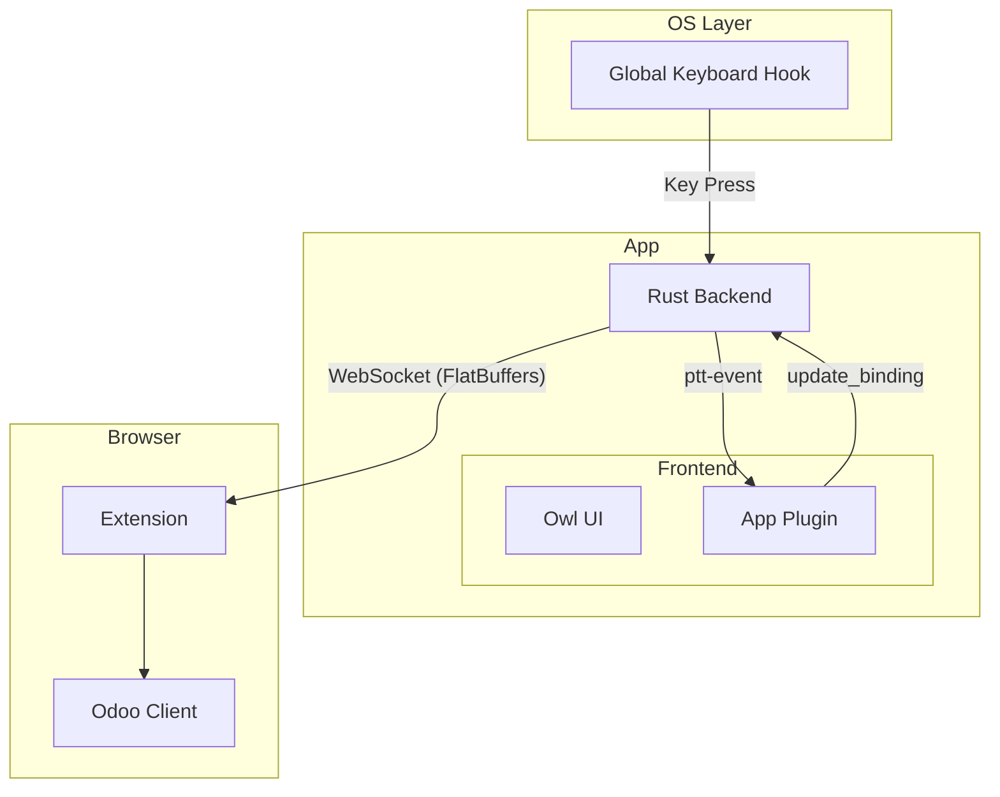
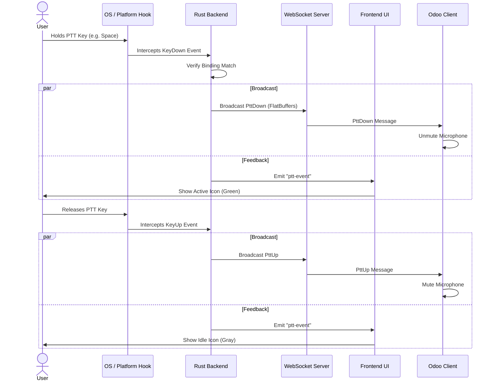
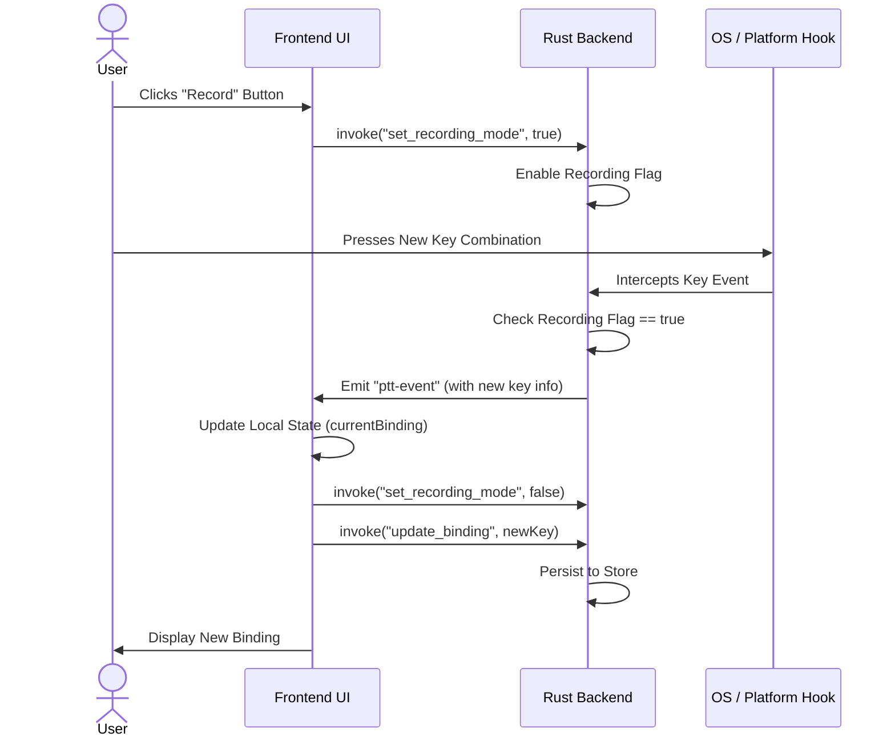

# Discuss Companion Application

## Table of Contents
- [Discuss Companion Application](#discuss-companion-application)
  - [Table of Contents](#table-of-contents)
  - [Architecture Overview](#architecture-overview)
  - [Core Components](#core-components)
    - [Backend (Rust)](#backend-rust)
    - [Frontend (Owl)](#frontend-owl)
  - [Communication \& Data Flow](#communication--data-flow)
    - [Internal Communication (IPC)](#internal-communication-ipc)
    - [External Communication (WebSocket)](#external-communication-websocket)
  - [Key Workflows](#key-workflows)
    - [Push-to-Talk Activation](#push-to-talk-activation)
    - [Key Binding Configuration](#key-binding-configuration)

## Architecture Overview

The application acts as a bridge between the User's Operating System and the web-based Odoo Discuss client.

The system consists of three main layers:
1.  **Input Capture Layer**: Intercepts global keyboard events (even when the app is backgrounded).
2.  **App Logic Layer**: Processes the input, manages state, and provides a UI for configuration.
3.  **Communication Layer**: Broadcasts the PTT state to connected clients (Odoo) via WebSocket.

---

## Core Components

### Backend (Rust)
Located in `app/backend`, it is responsible for input handling and the WebSocket server.

| Module                                   | Description                                                                                                                |
| :--------------------------------------- | :------------------------------------------------------------------------------------------------------------------------- |
| [`lib.rs`](backend/src/lib.rs)           | The entry point. Initializes logging, the Tauri application, and spawns the WebSocket server and Input Engine threads.     |
| [`server.rs`](backend/src/server.rs)     | Implements a **WebSocket server**. It handles connections from the Extension and broadcasts PTT messages.                  |
| [`state.rs`](backend/src/state.rs)       | Defines the domain models (`KeyBinding`, `OutgoingMessage`, `PttState`) and handles **FlatBuffers** serialization.         |
| [`platform/`](backend/src/platform)      | (OS-specific) Handles the low-level global keyboard hooks (using CoreGraphics on macOS) to detect key presses system-wide. |
| [`commands.rs`](backend/src/commands.rs) | Exposes functions to the frontend, such as `update_binding`, `get_ws_port`, and `force_ptt_up`.                            |

### Frontend (Owl)
Located in `app/frontend`, the UI is built using the **Owl Framework**.

| Component                                       | Description                                                                                                                                                             |
| :---------------------------------------------- | :---------------------------------------------------------------------------------------------------------------------------------------------------------------------- |
| [`main.ts`](frontend/main.ts)                   | Entry point. Mounts the Owl application.                                                                                                                                |
| [`app_plugin.ts`](frontend/app_plugin.ts)       | The core controller. Manages global state (recording mode, logs, connection status, current binding) using signals. It listens for backend events and invokes commands. |
| [`companion.ts`](frontend/companion.ts)         | The main layout component hosting the sub-pages.                                                                                                                        |
| [`control_page.xml`](frontend/control_page.xml) | The interface for viewing status and recording new keybindings.                                                                                                         |

---

## Communication & Data Flow

### Internal Communication (IPC)
Communication between the Rust Backend and the Owl Frontend uses Tauri's event system.

-   **Events (Rust -> JS)**:
    -   `ptt-event`: Fired when the PTT key is pressed or released. Payload contains the key code and modifiers.
    -   `ws-connection` / `ws-disconnection`: Notify the UI when an external client connects/disconnects.
    -   `error`: Reports backend errors.
-   **Commands (JS -> Rust)**:
    -   `invoke("set_recording_mode")`: Tells the backend to stop intercepting PTT for activation and instead capture the next keypress as the new binding.
    -   `invoke("update_binding")`: Saves the new keybinding to persistent storage.

### External Communication (WebSocket)
The application runs a local WebSocket server (default port `49152`) to communicate with Odoo.

**Protocol**: [FlatBuffers](https://google.github.io/flatbuffers/)
**Schema (`protocol.fbs`)**:
-   **Messages**: Binary payloads optimized for low latency.
-   **Types**:
    -   `PttDown`: Sent when the PTT key is pressed.
    -   `PttUp`: Sent when the PTT key is released.
    -   `Status`: Periodic or requested status updates.
    -   `Ping` / `Pong`: Heartbeat to maintain connection.
    -   `SetBinding`: Allows the remote client to configure the binding.

**Why use FlatBuffers?**
FlatBuffers allows us to send binary data directly without parsing/unpacking overhead, ensuring minimal latency and CPU usage.

---

## Key Workflows

### Push-to-Talk Activation

1.  **User holds the global shortcut key** (e.g., Spacebar).
2.  **Platform Engine** (`backend/src/platform`) intercepts the OS event.
3.  **Engine** sends a signal to `PttHandler`.
4.  `PttHandler` verifies the key matches the configured binding.
5.  **If Match**:
    -   Updates internal state `is_active = true`.
    -   Changes Tray Icon to "Active" (Green).
    -   **Broadcasts** `PttDown` message to all connected WebSocket clients.
    -   Emits `ptt-event` to the frontend UI (for visual feedback).
6.  **Odoo Client** receives `PttDown` and unmutes the microphone.
7.  **User releases the key**.
8.  Reverse process occurs (`PttUp` sent), and Odoo mutes the microphone.

### Key Binding Configuration

1.  User clicks the **"Record"** button in the UI.
2.  Frontend calls `set_recording_mode(true)`.
3.  Backend enables "recording mode" flag.
4.  User presses a new key combination.
5.  Backend captures this specific event.
6.  Backend emits `ptt-event` with the new key details to Frontend.
7.  Frontend:
    -   Updates local state (`currentBinding`).
    -   Calls `set_recording_mode(false)`.
    -   Calls `update_binding(...)` to persist the change.
    -   Displays the new binding in the UI.

