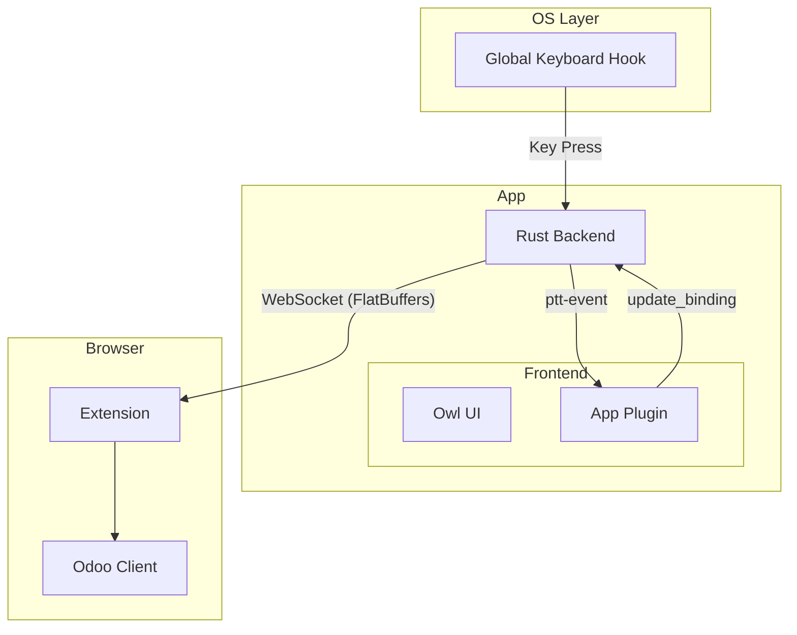

# Discuss Companion Application

## Table of Contents
- [Discuss Companion Application](#discuss-companion-application)
  - [Table of Contents](#table-of-contents)
  - [Architecture Overview](#architecture-overview)
  - [Core Components](#core-components)
    - [Backend (Rust)](#backend-rust)
    - [Frontend (Owl)](#frontend-owl)

## Architecture Overview

The application acts as a bridge between the User's Operating System and the web-based Odoo Discuss client.

The system consists of three main layers:
1.  **Input Capture Layer**: Intercepts global keyboard events (even when the app is backgrounded).
2.  **App Logic Layer**: Processes the input, manages state, and provides a UI for configuration.
3.  **Communication Layer**: Broadcasts the PTT state to connected clients (Odoo) via WebSocket.

---

## Core Components

### Backend (Rust)
Located in `app/backend`, it is responsible for input handling, runtime wiring, and the WebSocket server.

| Module                                             | Description                                                                                                                    |
| :------------------------------------------------- | :----------------------------------------------------------------------------------------------------------------------------- |
| [`lib.rs`](backend/src/lib.rs)                     | Entry point. Initializes logging/profiling and delegates app composition to the runtime module.                                |
| [`runtime.rs`](backend/src/runtime.rs)             | **Runtime wiring**: builds the Tauri `Builder`, sets up the WS server, tray, menus, and starts the PTT engine and event loop.  |
| [`api/commands.rs`](backend/src/api/commands.rs)   | Tauri command handlers (IPC from frontend). Includes binding updates, WS port changes, app/window commands, and state queries. |
| [`api/ws_server.rs`](backend/src/api/ws_server.rs) | WebSocket server for the browser extension. Accepts connections and broadcasts PTT + call state via FlatBuffers.               |
| [`protocol/`](backend/src/protocol)                | Domain types and serialization. `types.rs` defines `KeyBinding`, `CallState`, etc. `messages.rs` builds FlatBuffers payloads.  |
| [`ptt_engine/`](backend/src/ptt_engine)            | OS-specific global keyboard hooks (CoreGraphics on macOS, X11 on Linux). Emits PTT events to the runtime.                      |
| [`interface/`](backend/src/interface)              | UI integration for system surfaces: tray, call controls window, and menu handling.                                             |

### Frontend (Owl)
Located in `app/frontend`, the UI is built using the **Owl Framework**.

| Component                                       | Description                                                                                                                                                             |
| :---------------------------------------------- | :---------------------------------------------------------------------------------------------------------------------------------------------------------------------- |
| [`main.ts`](frontend/main.ts)                   | Entry point. Mounts the Owl application.                                                                                                                                |
| [`app_plugin.ts`](frontend/app_plugin.ts)       | The core controller. Manages global state (recording mode, logs, connection status, current binding) using signals. It listens for backend events and invokes commands. |
| [`companion.ts`](frontend/companion.ts)         | The main layout component hosting the sub-pages.                                                                                                                        |
| [`control_page.xml`](frontend/control_page.xml) | The interface for viewing status and recording new keybindings.                                                                                                         |
