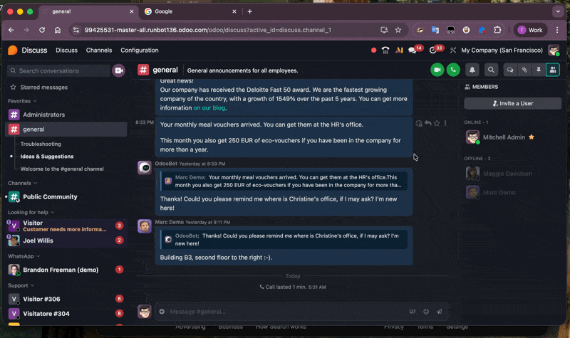

# Discuss PTT Agent Extension

Standalone Browser Extension for Odoo Discuss Push-to-Talk.

The extension is derived from Odoo's own extension for Push-to-Talk.

[associated Odoo license](LICENSE)

## Features

### When running standalone:

- Extension shortcut push-to-talk (not system wide on macOS)
- Mute/Unmute (and more planned)
- Quick access to the call tab

### When running alonside the app:

- System-wide Push-to-Talk via Tauri Desktop Agent
- WebSocket communication (no Native Messaging hurdles)
- Automatic discovery for Odoo instances

## How it works
This extension connects to a WebSocket server running locally on port `49152` (provided by the Discuss Companion Tauri app). It acts as a bridge between the system-wide key events captured by the desktop app and the Odoo web interface.