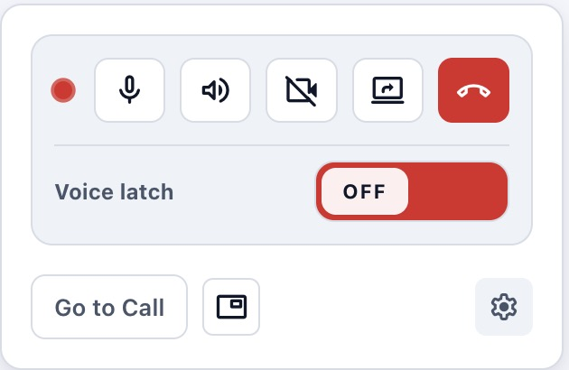

# Discuss PTT Agent Extension

Standalone Browser Extension for Odoo Discuss Push-to-Talk.

The extension is derived from Odoo's own extension for Push-to-Talk.

[associated Odoo license](LICENSE)

## Features

### When running standalone:

- Extension shortcut push-to-talk (not system wide on macOS)
- Mute/Unmute/camera/share-screen/leave-call
- Quick access to the call tab and activation of picture-in-picture.
- Voice activation toggle

### When running alonside the app:

- System-wide Push-to-Talk
- Systray "talking" indicator
- Mute/Unmute/camera/share-screen/leave-call in systray

## How it works
This extension connects to a WebSocket server running locally (provided by the Discuss Companion app). It acts as a bridge between the system-wide key events captured by the desktop app and Odoo (web).
